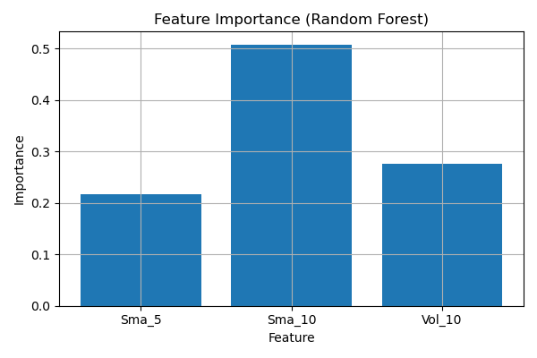

ML Stock Classifier – Buy/Sell Predictor”

This project builds a supervised ML model to predict whether AAPL stock will go **UP or DOWN** the next day using technical indicators.

---

## 🧠 Features

## 🚀 Features

- 📈 Predicts BUY/SELL signals using a trained Random Forest Classifier
- 📊 Uses historical stock data with technical indicators like returns and moving averages
- 🧠 Includes train/test split with model evaluation (accuracy, confusion matrix)
- 📦 Built with `pandas`, `scikit-learn`, and `matplotlib`
- ✅ Clean, modular code structure ready for further enhancement or deployment

---

## 📊 Model Performance

- Classifier: **Random Forest (n=100)**
- Accuracy: **66.7%**
- Evaluation: **Confusion Matrix + Feature Importance**

---

## 💾 Files

- `ml_stock_classifier.py` – training & evaluation script
- `aapl.csv` – historical data (2024)
- `importance_plot.png` – visual explanation
- `README.md` – this file

---

## 🧾 Author

Shiva Sai | Quant + FinTech Track | Pre-WashU MSF 2025
